# PRIME — Database Architecture

Status: Phase 1 (proposed). No database, schema, or migration has been
created yet — this document defines the strategy and target design that
Phase 2/3 will implement.

---

## 1. Platform

**Decision: Supabase hosts PostgreSQL, PostGIS, Auth, and Storage for
shared/staging/production. Local development uses the native PostgreSQL 16
install found in Phase 0.** (Product direction, 2026-09-23.)

- **Shared/staging/production**: managed **Supabase** Postgres project.
  Exact Postgres major version is whatever Supabase provisions for the
  project — record it once the project is created (Phase 2), do not assume
  it matches local 16.15.
- **Local development**: the local **PostgreSQL 16.15** + **PostGIS 3.6.2**
  found in Phase 0, running as service `postgresql-x64-16`. Used for
  schema/business-logic development, EF Core migration authoring, and unit/
  integration tests that don't need real Supabase Auth/Storage.
- **PostGIS**: enabled per-database on both — `CREATE EXTENSION postgis;` —
  not yet done on either, since no PRIME database exists yet anywhere.
- **Schema parity between local and Supabase**: PRIME's own tables
  (everything in DOMAIN-MODEL.md) live in `public` on both. Supabase
  additionally has an `auth` schema (managed by Supabase Auth/GoTrue) and a
  `storage` schema (managed by Supabase Storage) that **do not exist on the
  local Postgres install**. Consequence: no PRIME migration may create a
  hard foreign-key constraint from a `public` table into `auth.*` or
  `storage.*`, or that migration will fail to apply locally. References to
  the authenticated user (e.g. `AppUser.SupabaseUserId`) are plain `uuid`
  columns with a unique index, not FK constraints — see DOMAIN-MODEL.md
  §3.22 and ARCHITECTURE.md §3.4.
- Single database per environment (e.g. local `prime_dev`, Supabase project
  per environment for staging/prod), single schema (`public`) for PRIME's
  own tables — CLAUDE.md does not require schema-per-module, and a single
  schema keeps EF Core migrations simpler; can be revisited if multi-LGU
  tenancy (see §13) demands isolation.

### 1.1 Connection pooling (Supabase-specific)

Supabase fronts Postgres with **PgBouncer**. Two connection strings exist
per Supabase project:

| Use | Port | Mode | Notes |
|---|---|---|---|
| EF Core migrations (`dotnet ef database update`), any DDL, advisory locks | 5432 | Direct/session | Needed for real session semantics |
| Application runtime queries | 6543 | Transaction-pooled | Higher connection concurrency; **not** safe for server-side prepared statement caching |

Npgsql must be configured for transaction-pooling compatibility on the
runtime connection: disable automatic server-side prepared statements
(`Max Auto Prepare=0` in the connection string, or the equivalent
`NpgsqlDataSourceBuilder` setting). This does not apply to the local dev
Postgres connection, which is a normal direct connection with no pooler in
front of it.

### 1.2 Row Level Security (RLS)

Because PRIME's own ASP.NET Core Web API is the sanctioned access path for
business data (not Supabase's auto-generated PostgREST/GraphQL API), RLS on
`public` tables is **defense-in-depth, not the primary authorization
mechanism** — PRIME's role/permission/maker-checker checks in
`Prime.Application` are the source of truth (CLAUDE.md Rule 9 extended to
authorization, not just calculation logic). Recommended baseline: RLS
enabled with a deny-by-default policy on every table holding taxpayer or
financial data, so that even a misconfigured Supabase auto-API exposure
cannot leak data. Supabase **Storage** bucket policies follow the same
principle — see ARCHITECTURE.md §3.9.

### 1.3 Backup & recovery

Supabase provides automated backups (frequency/PITR depends on project
tier — confirm the tier before relying on a specific RPO). This does not
by itself satisfy CLAUDE.md §79: a restore must actually be tested (Phase
14), not assumed to work because a backup exists. The local dev database
is not backed up by anything other than normal developer discipline (it is
disposable/reproducible from migrations + seed data).

---

## 2. Naming conventions

- Tables: `PascalCase`, singular (`Property`, `TaxDeclaration`) — matches
  EF Core default conventions and the entity names in DOMAIN-MODEL.md.
- Primary keys: `<Entity>Id`.
- Foreign keys: `<ReferencedEntity>Id`.
- Junction/link tables: `<EntityA><EntityB>` (e.g. `PropertyTaxpayer`,
  `UserRole`, `RolePermission`).
- Indexes: `IX_<Table>_<Columns>`. Spatial indexes: `SX_<Table>_<Column>`
  (GiST).
- Constraints: `FK_<Table>_<ReferencedTable>`, `UQ_<Table>_<Columns>`,
  `CK_<Table>_<Rule>`.

---

## 3. Key columns present on every table (unless noted otherwise)

```text
CreatedAt      timestamptz not null
UpdatedAt      timestamptz null
CreatedBy      FK → User (nullable only for system-seeded reference data)
UpdatedBy      FK → User (nullable)
```

Financial/assessment/workflow-governed tables additionally carry:

```text
RowVersion     xmin-based or explicit bytea/uint rowversion — optimistic concurrency (§66)
```

Append-only tables (`AuditLog`) omit `UpdatedAt`/`UpdatedBy` entirely —
there is no update path.

---

## 4. Effective-dating & history strategy

PRIME must never overwrite: Tax Declarations, Assessments, SMVs,
Assessment Levels, ownership, payments, bills, transactions, audit logs
(§28, §32, §49, §76). The uniform pattern used across all of these:

1. A row has `EffectiveDate` and, where it can be superseded while the old
   value remains queryable "as of" a past date, an `EndDate`
   (nullable = currently effective) and/or an `IsCurrent` flag
   (`PropertyTaxpayer` uses this explicitly).
2. Where a record is literally replaced by a new version (Tax Declaration,
   Assessment), the new row carries a `Previous<Entity>Id` self-referencing
   FK, forming a linked history chain instead of an in-place update.
3. Queries for "current" state filter `WHERE IsCurrent = true` (or
   `EndDate IS NULL`, or `Status = 'APPROVED'/'POSTED'` combined with
   `EffectiveDate <= @asOf AND (EndDate IS NULL OR EndDate > @asOf)` for
   point-in-time queries).
4. Every effective-dated table gets a composite index covering
   `(<naturalKey>, EffectiveDate)` at minimum, to keep "what was effective
   on date X" queries index-backed rather than table scans (§64 "
   effective-date indexes").

This directly answers the two questions CLAUDE.md §76 requires the system
to answer: "what was the assessment on a given date" and "why did it
change" (the latter via `AuditLog.Reason` + the `Previous*Id` chain +
`PropertyTransaction`).

---

## 5. Soft delete

No `DELETE` statement is issued against the tables listed in CLAUDE.md §49.
Enforcement:

- At the EF Core layer, `DbContext` does not expose a delete path for those
  `DbSet`s outside of a small, explicitly-reviewed set of repository
  methods (e.g. `Void(paymentId, reason)` instead of `Remove(payment)`).
- A PostgreSQL-level safety net (e.g. a `BEFORE DELETE` rule/trigger that
  raises an exception, or simply revoking `DELETE` privilege on those
  tables from the application's database role) is a candidate hardening
  step for Phase 14; decision deferred, not required to start Phase 2/3.

---

## 6. Audit trail implementation

`AuditLog` rows are written by an EF Core `SaveChanges` interceptor in
`Prime.Infrastructure`, not by individual feature handlers, so no write
path can silently skip auditing. The interceptor:

- Inspects the `ChangeTracker` for tracked entities implementing an
  `IAuditable` marker.
- Serializes changed properties (old/new) to `AuditLog.OldValue`/`NewValue`
  (JSON).
- Requires the current `UserId`/`IPAddress` (from the request context) and
  a `Reason` for state-transition actions (approve/reject/void/reverse)
  where CLAUDE.md requires one.

Database-level triggers were considered and rejected as the *primary*
mechanism (harder to unit test, harder to attach the acting user/IP/reason
which only the application layer has); they remain an optional
defense-in-depth addition later.

---

## 7. Concurrency & transactions

- Optimistic concurrency token on assessment/billing/payment tables
  (Postgres `xmin` mapped via EF Core, or an explicit `RowVersion` column)
  to protect against simultaneous assessment changes / simultaneous
  approvals (§66).
- Duplicate submission protection: unique constraints on natural business
  keys (`TaxDeclarationNumber`, `OfficialReceiptNumber`, idempotency key on
  payment posting requests) plus DB transactions wrapping
  posting/allocation logic so a payment and its allocations commit
  atomically or not at all.
- All financial/assessment write operations execute inside an explicit
  `DbContext` transaction (or a single `SaveChanges` call covering the
  full aggregate) — never partial writes split across multiple round trips
  without a transaction boundary.

---

## 8. Money

- C#: `decimal`.
- PostgreSQL: `numeric(p, s)`.
- **Exact precision/scale is a domain-verification item**: CLAUDE.md
  mandates `numeric`/`decimal` but does not specify precision. Philippine
  peso amounts typically need 2 decimal places for currency and
  potentially more for rates/factors (e.g. assessment percentage,
  depreciation rate). Proposed defaults, to be confirmed once real
  ordinance/BLGF rate formats are reviewed:
  - Currency amounts (market value, assessed value, bill/payment amounts):
    `numeric(18,2)`.
  - Percentages/rates (assessment level, depreciation rate, penalty/interest
    rate): `numeric(9,6)`.
  - Areas: `numeric(14,4)` (land/floor area may need sub-integer precision).
- `float`/`double` are not used anywhere in the monetary or assessment
  calculation path (§65).

---

## 9. Spatial data

- Geometry columns use PostGIS `geometry` type (not `geography`), since
  cadastral work is typically done in a projected CRS for accurate
  area/distance rather than the geographic calculations `geography` is
  optimized for.
- **Canonical storage SRID is a domain-verification item.** Philippine
  cadastral survey data is often supplied referenced to PRS92 (and its
  associated UTM zones covering the Philippines), while web-mapping display
  conventionally uses WGS84 (EPSG:4326) / Web Mercator (EPSG:3857).
  PRIME must not silently assume one. Working assumption until confirmed:
  store in **EPSG:4326** for interoperability and reproject to a suitable
  projected CRS only for area/distance calculations that require it,
  **pending confirmation of the actual SRID used by the target LGU's
  survey/GIS data.**
- Every geometry column gets a GiST spatial index (`SX_Parcel_Geometry`,
  etc.) per CLAUDE.md §64/§71.
- Geometry validity: imported geometries are validated (`ST_IsValid`)
  during the Data Import workflow (§60/§61) before acceptance — invalid
  geometry is a data-quality error, not silently imported.

---

## 10. ERD (proposed, core lifecycle)

This covers the property → tax lifecycle core; reference/lookup tables
(Province, Barangay, Classification, ActualUse, etc.) are omitted from the
diagram for readability but are referenced by FK from the entities shown,
exactly as listed in DOMAIN-MODEL.md §3.10.

```mermaid
erDiagram
    TAXPAYER ||--o{ PROPERTY_TAXPAYER : "owns via"
    PROPERTY ||--o{ PROPERTY_TAXPAYER : "owned via"
    PROPERTY ||--o{ PARCEL : has
    PROPERTY ||--o{ RPU : has
    RPU ||--o{ TAX_DECLARATION : "declared via"
    RPU ||--o| LAND : "is (if LAND)"
    RPU ||--o| BUILDING : "is (if BUILDING)"
    RPU ||--o| MACHINERY : "is (if MACHINERY)"
    BUILDING ||--o{ BUILDING_COMPONENT : "composed of"
    RPU ||--o{ ASSESSMENT : "assessed via"
    TAX_DECLARATION }o--|| SMV_SCHEDULE : "valued using"
    ASSESSMENT }o--|| ASSESSMENT_LEVEL : "applies"
    ASSESSMENT }o--|| SMV : "cites"
    PROPERTY ||--o{ PROPERTY_TRANSACTION : "history of"
    PROPERTY ||--o{ TAX_BILL : "billed via"
    TAX_BILL ||--o{ TAX_BILL_DETAIL : "line items"
    TAX_BILL ||--o{ PAYMENT_ALLOCATION : "paid via"
    PAYMENT ||--o{ PAYMENT_ALLOCATION : allocates
    PROPERTY ||--o{ PROPERTY_EXEMPTION : "exempted via"
    PROPERTY_EXEMPTION ||--o{ EXEMPTION_DOCUMENT : "supported by"
    EXEMPTION_DOCUMENT }o--|| DOCUMENT : references
    PROPERTY ||--o{ DELINQUENCY : "tracked via"
    APP_USER ||--o{ USER_ROLE : has
    ROLE ||--o{ USER_ROLE : "assigned to"
    ROLE ||--o{ ROLE_PERMISSION : grants
    PERMISSION ||--o{ ROLE_PERMISSION : "granted via"

    TAXPAYER {
        uuid TaxpayerId PK
        string TaxpayerType
        string TIN
        string Status
    }
    PROPERTY {
        uuid PropertyId PK
        string PropertyIdentificationNumber UK
        string Status
    }
    PROPERTY_TAXPAYER {
        uuid PropertyTaxpayerId PK
        uuid PropertyId FK
        uuid TaxpayerId FK
        decimal OwnershipPercentage
        date StartDate
        date EndDate
        bool IsCurrent
    }
    PARCEL {
        uuid ParcelId PK
        uuid PropertyId FK
        geometry Geometry
        decimal Area
        string Status
    }
    RPU {
        uuid RpuId PK
        uuid PropertyId FK
        string RpuNumber UK
        string RpuType
        date EffectivityDate
        uuid PreviousRpuId FK
        string Status
    }
    TAX_DECLARATION {
        uuid TaxDeclarationId PK
        uuid RpuId FK
        string TaxDeclarationNumber UK
        int RevisionNumber
        int AssessmentYear
        uuid PreviousTaxDeclarationId FK
        string Status
    }
    LAND {
        uuid LandId PK
        uuid RpuId FK
        decimal Area
        decimal MarketValue
        decimal AssessedValue
    }
    BUILDING {
        uuid BuildingId PK
        uuid RpuId FK
        decimal FloorArea
        decimal MarketValue
        decimal DepreciatedValue
        decimal AssessedValue
    }
    BUILDING_COMPONENT {
        uuid BuildingComponentId PK
        uuid BuildingId FK
        uuid ComponentTypeId FK
        decimal Cost
    }
    MACHINERY {
        uuid MachineryId PK
        uuid RpuId FK
        decimal AcquisitionCost
        decimal MarketValue
        decimal AssessedValue
    }
    SMV {
        uuid SmvId PK
        string OrdinanceNumber
        date EffectivityDate
        string Status
    }
    SMV_SCHEDULE {
        uuid SmvScheduleId PK
        uuid SmvId FK
        decimal MarketValue
        date EffectiveDate
        date EndDate
    }
    ASSESSMENT_LEVEL {
        uuid AssessmentLevelId PK
        decimal AssessmentPercentage
        date EffectiveDate
        date EndDate
    }
    ASSESSMENT {
        uuid AssessmentId PK
        uuid RpuId FK
        int AssessmentYear
        decimal MarketValue
        decimal AssessedValue
        uuid SmvId FK
        string AssessmentStatus
    }
    PROPERTY_TRANSACTION {
        uuid PropertyTransactionId PK
        uuid PropertyId FK
        string TransactionType
        date EffectiveDate
        string Status
    }
    TAX_BILL {
        uuid TaxBillId PK
        uuid PropertyId FK
        int TaxYear
        decimal TotalAmountDue
        string Status
    }
    TAX_BILL_DETAIL {
        uuid TaxBillDetailId PK
        uuid TaxBillId FK
        string ComponentType
        decimal Amount
    }
    PAYMENT {
        uuid PaymentId PK
        uuid TaxpayerId FK
        decimal Amount
        string OfficialReceiptNumber UK
        string Status
    }
    PAYMENT_ALLOCATION {
        uuid PaymentAllocationId PK
        uuid PaymentId FK
        uuid TaxBillId FK
        decimal AllocatedAmount
    }
    DELINQUENCY {
        uuid DelinquencyId PK
        uuid PropertyId FK
        int TaxYear
        decimal OutstandingPrincipal
    }
    PROPERTY_EXEMPTION {
        uuid PropertyExemptionId PK
        uuid PropertyId FK
        uuid ExemptionTypeId FK
        string LegalBasis
        string Status
    }
    EXEMPTION_DOCUMENT {
        uuid ExemptionDocumentId PK
        uuid PropertyExemptionId FK
        uuid DocumentId FK
    }
    DOCUMENT {
        uuid DocumentId PK
        string Bucket
        string StoragePath
        string ContentType
        uuid DocumentTypeId FK
        string RelatedEntityType
        uuid RelatedEntityId
        string Status
    }
    APP_USER {
        uuid AppUserId PK
        uuid SupabaseUserId UK "value only, not a DB FK - see 1"
        string DisplayName
        string Status
    }
    ROLE {
        uuid RoleId PK
        string Code UK
    }
    PERMISSION {
        uuid PermissionId PK
        string Code UK
    }
    USER_ROLE {
        uuid AppUserId FK
        uuid RoleId FK
    }
    ROLE_PERMISSION {
        uuid RoleId FK
        uuid PermissionId FK
    }
```



`AuditLog` is intentionally not drawn above with FK arrows to every table —
it references `(TableName, RecordId)` generically across all auditable
entities rather than a typed FK per table, since it must audit any table by
design (§48).

---

## 11. Indexing strategy

- PK: clustered/default btree on every surrogate key.
- Business/search keys: unique index on `PropertyIdentificationNumber`,
  `RpuNumber`, `TaxDeclarationNumber`, `TIN` (per taxpayer, not globally
  unique across taxpayer types unless confirmed), `OfficialReceiptNumber`.
- Search (§56): btree indexes on `Property.PropertyIdentificationNumber`,
  `TaxDeclaration.TaxDeclarationNumber`, `RPU.RpuNumber`, taxpayer
  name fields, `TIN`, `LotNumber`, `TitleNumber`, `SurveyNumber`,
  `Barangay`, `TaxMapNumber`; consider a `pg_trgm` GIN index for
  free-text/partial name and address search.
- Spatial: GiST index on every `geometry` column.
- Effective-date composite indexes per §4 above.
- Foreign keys are indexed by default via EF Core conventions; verified
  explicitly for high-traffic joins (Payment→TaxBill, Assessment→RPU).

---

## 12. Migration strategy

- EF Core Code-First migrations, one migration per meaningful schema
  change, committed alongside the entity/configuration change that caused
  it.
- **Additive-first**: prefer nullable-column-add / new-table migrations
  over destructive column drops/type changes.
- Any destructive migration (drop column/table, narrow a type) requires,
  per CLAUDE.md §105: naming the affected tables, explaining the
  consequence, and explicit confirmation before it is applied to anything
  beyond a local dev database. No migration auto-applies to production.
- Seed data is limited to reference-table scaffolding and clearly-labeled
  `DEMO_*` records (§81) — never invented LGU legal values.
- **Applying migrations to Supabase**: run against the **direct connection**
  (§1.1) — the transaction-pooled connection does not support the
  session/advisory-lock behavior EF Core's migrator relies on. The same
  migration set is applied to both the local dev database and each
  Supabase environment (dev/staging/prod project), in the same order —
  there is no divergent "Supabase-only" migration path for PRIME's own
  `public` schema tables.

---

## 13. Open database questions (do not guess — verify before Phase 3)

1. Canonical spatial reference system (SRID) for stored geometry — see §9.
2. Monetary column precision/scale — see §8.
3. Whether `TIN` uniqueness is enforced globally or is allowed to repeat
   across distinct taxpayer records representing the same real-world
   entity in different LGU contexts (multi-LGU/tenancy question, see
   ARCHITECTURE.md and roadmap).
4. Whether PRIME will ever be multi-tenant (multiple LGUs sharing one
   deployment) or is one deployment per LGU — materially affects whether a
   `LguId`/tenant discriminator column belongs on every table, and whether
   one Supabase project serves all LGUs or each LGU gets its own project.
   **Not specified in CLAUDE.md; flagged for product clarification, not
   assumed.**
5. Supabase project tier/region for each environment — affects connection
   limits, backup/PITR availability (§1.3), and Philippine data-residency
   considerations for taxpayer PII (§68), which should be confirmed before
   real LGU data is loaded into any Supabase project.
6. Whether Supabase's local CLI stack (`supabase start`, requires Docker)
   is adopted for fully-offline Auth/Storage development, or whether the
   team standardizes on a shared cloud dev project instead — see
   ARCHITECTURE.md §3.4/§5.
